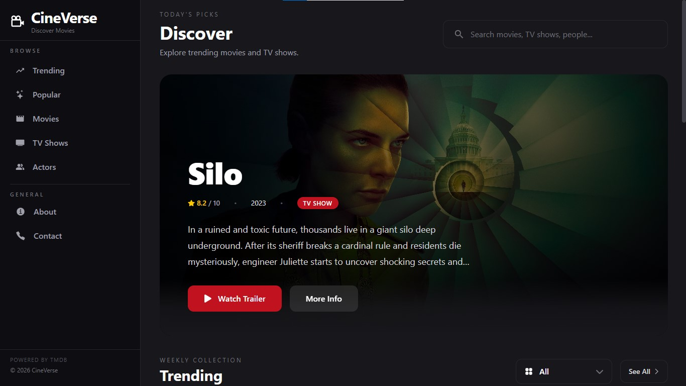
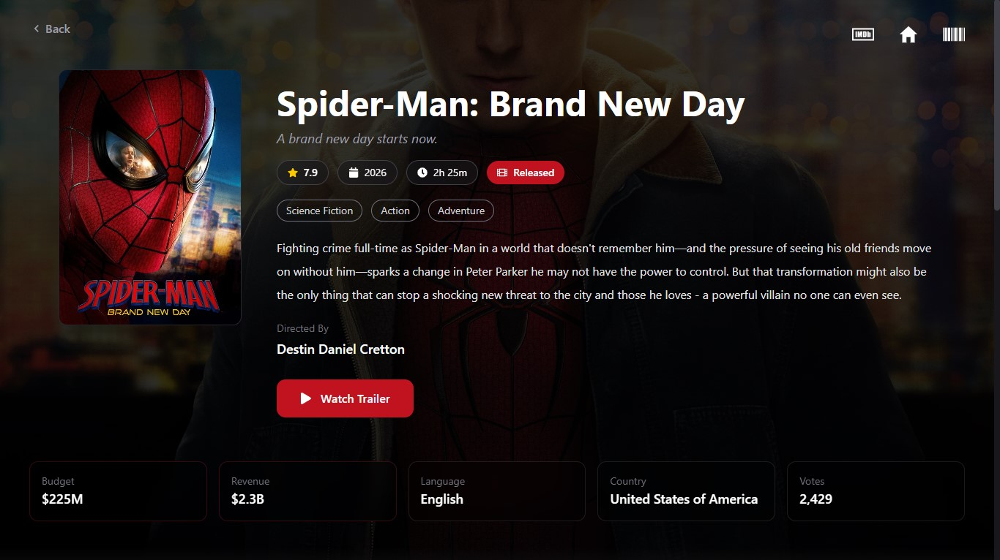
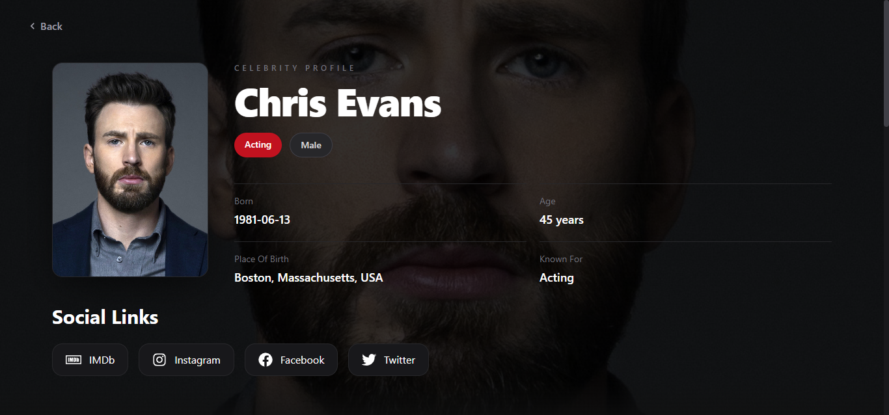
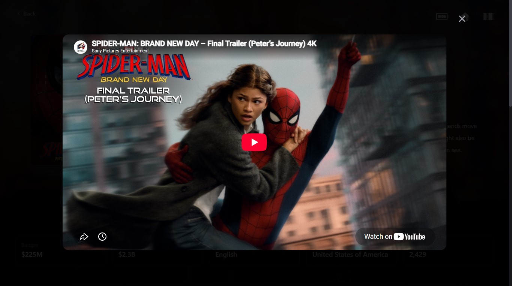
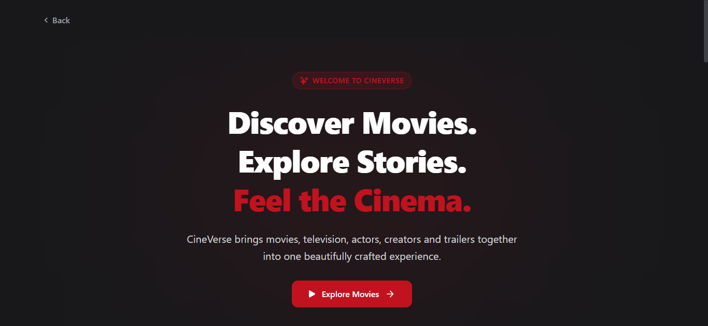
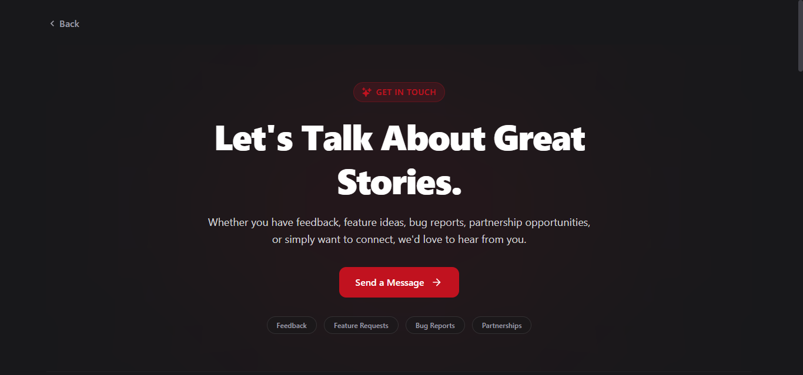
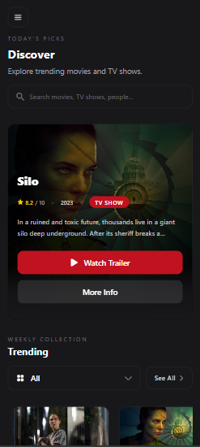

# 🎬 CineVerse

A modern movie discovery platform built with React that allows users to explore movies, TV shows, celebrities, trailers, ratings, and entertainment information through a clean, cinematic, and fully responsive user interface.

🌐 **Live Demo:**  
https://cine-verse-f4z2t16hr-kenil3.vercel.app

🔗 **GitHub Repository:**  
https://github.com/kenil948/CineVerse

---

## ✨ Features

### 🎥 Movies

- Browse trending movies
- Explore popular movies
- View detailed movie information
- Watch official trailers
- View ratings and release information
- Explore production companies
- Discover similar movies

### 📺 TV Shows

- Browse trending TV shows
- Explore popular TV content
- View detailed show information
- Watch trailers
- View season and episode information
- Discover similar TV shows

### 👤 Celebrity Profiles

- View actor and celebrity profiles
- Read biographies
- Explore filmography
- Access social media links
- View personal information and career details

### 🔍 Search Functionality

- Search movies
- Search TV shows
- Search celebrities
- Instant navigation to detailed pages

### 📱 Responsive Design

- Desktop optimized
- Tablet friendly
- Mobile responsive
- Smooth navigation experience

### 🎨 Modern UI/UX

- Dark cinematic theme
- Dynamic backdrops
- Interactive cards
- Smooth transitions
- Consistent design language

### 🛡️ Robust Error Handling

- Image fallbacks
- Missing data handling
- Empty state components
- Graceful loading and error states

---

## 🖼️ Screenshots

### Home Page



### Movie Details



### Person Details



### Trailer Modal



### About Page



### Contact Page



### Mobile Responsive View



---

## 🚀 Tech Stack

### Frontend

- React.js
- React Router DOM
- Tailwind CSS
- Axios

### API

- TMDB (The Movie Database)

### UI & Icons

- React Icons
- Lucide React

### Deployment

- Vercel

---

## 🚀 Getting Started

### Clone the Repository

```bash
git clone https://github.com/kenil948/CineVerse.git
```

### Navigate to the Project

```bash
cd CineVerse
```

### Install Dependencies

```bash
npm install
```

### Start the Development Server

```bash
npm run dev
```

The application will be available at:

```txt
http://localhost:5173
```

---

## 🏗️ Build for Production

Create a production build:

```bash
npm run build
```

Preview the production build locally:

```bash
npm run preview
```

---

## 🌟 Highlights

- Modern movie discovery experience
- Real-time TMDB data integration
- Dedicated movie, TV show, and celebrity pages
- Embedded trailer viewing experience
- Fully responsive across devices
- Clean and maintainable React architecture
- Production-ready deployment on Vercel

---

## 🔮 Future Improvements

- User authentication
- Favorites / Watchlist
- Advanced filtering options
- Search suggestions
- Personalized recommendations
- Infinite scrolling
- Progressive Web App (PWA) support

---

## 🙏 Acknowledgements

- TMDB for providing movie and TV show data
- React Community
- Tailwind CSS
- Vercel for deployment and hosting

---

## 📄 Disclaimer

This product uses the TMDB API but is not endorsed or certified by TMDB.

---

## 👨‍💻 Developer

**Kenil Chodavadiya**

If you enjoyed this project, consider giving it a ⭐ on GitHub.

---
Made with ❤️ and lots of ☕ by Kenil Chodavadiya.
